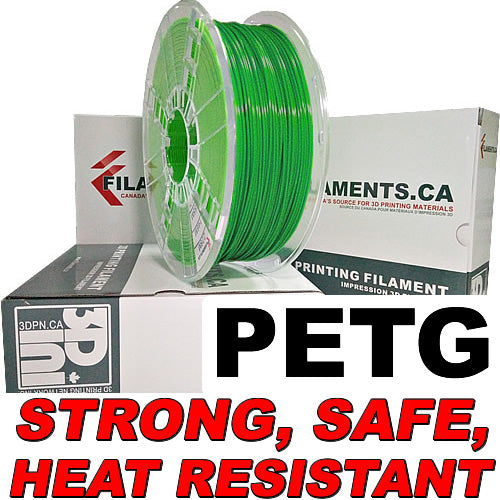

# Background
I wanted to compare 3D filaments color correctness between different brands as much as possible without needing to have the physical filament in hand.
Using [Hyigers's FilamentDB](https://github.com/hyiger/filament-db/blob/main/README.md) and the function "Browse OpenPrintTag DB" led me to create a small [python script](https://github.com/gertlind/optd-color/blob/main/README.md) where you can search for the color code and list the brands that offers filament with the color code you want.  
Read up on how RGB works:
[RGB Explained](https://en.wikipedia.org/wiki/RGB_color_model)

---
python3 optd_color.py 41a840ff --material PETG
Hits for color #41a840ff, material PETG: 9

Brands:
- ATARAXIA ART
- CC3D
- Creality
- EconoFil
- Numakers
- SMART MATERIALS 3D
- add:north
- extrudr

Details:
- ATARAXIA ART | PETG | PETG Green | #41a840ff
  Photo: https://files.openprinttag.org/ataraxia-art/ataraxia-art-petg-green/beefdc4ad5ec.jpg
- CC3D | PETG | Translucen PETG Grass Green | #41a840ff
  Photo: https://files.openprinttag.org/cc3d/cc3d-translucen-petg-grass-green/5c166701d874.jpg
- Creality | PETG | PETG Green | #41a840ff
  Photo: https://files.openprinttag.org/creality/creality-petg-green/f2bcfcf5ed16.jpg
- EconoFil | PETG | Standard PETG Dark Green | #41a840ff
- Numakers | PETG | PETG-HS Grass Green | #41a840ff
  Photo: https://files.openprinttag.org/numakers/numakers-petg-hs-grass-green/numakers-petg-hs-grass-green-0-228b2dac.jpg
- SMART MATERIALS 3D | PETG | PETG Chlorophyll | #41a840ff
  Photo: https://files.openprinttag.org/smart-materials-3d/smart-materials-3d-petg-chlorophyll/b9bea2c97ed8.png
- add:north | PETG | PETG Green | #41a840ff
  Photo: https://files.openprinttag.org/addnorth/addnorth-petg-green/e0f5c394943b.png
- extrudr | PETG | PETG signal green | RAL 6037 | #41a840ff
  Photo: https://files.openprinttag.org/extrudr/extrudr-petg-signal-green-ral-6037/5c0f75c487a3.png
- extrudr | PETG | PETG transparent green | RAL 6018 | #41a840ff
  Photo: https://files.openprinttag.org/extrudr/extrudr-petg-transparent-green-ral-6018/790f5db853e0.png

| Brand  | Name | Picture | 
| -------|:------:| ------------- |
| color we are looking for| [41a840](" width="120">) |
| ATARAXIA ART|[PETG Green](https://ataraxiaart.com/product/ataraxia-art-petg-filament-1-75mm-3d-printer-filament-1-kg-2-2-lb-spool-dimensional-accuracy-0-02mm-with-storage-resealable-vacuum-bag-v2-fit-most-fdm-printer-pantone-matched-petg-green/)||
| CC3D  |[Translucen PETG Grass Green](https://cc3dglobal.com/product/translucent-green-petg-filament/)|  |
| Creality  |[PETG Green](https://store.creality.com/eu/products/hyper-petg-filament-1-75mm-1kg)|  |
| EconoFil  |[Standard PETG Dark Green](https://filaments.ca/products/econofil-standard-petg-green?_pos=2&_sid=682e45fd2&_ss=r)| |
| Numakers  | [PETG-HS Grass Green](https://numakers.com/products/petg-hs-filament?variant=48182325182772)||
| SMART MATERIALS 3D  |[PETG Chlorophyll](https://www.smartmaterials3d.com/inicio?q=MATERIAL-PETG/Color-Chlorophyll)||
| add:north  |[PETG Green](https://addnorth.se/product/PETG/PETG%20-%201.75mm%20-%201000g%20-%20Green)||
| extrudr  | [PETG signal green](https://www.extrudr.com/en/se/products/petg/?variant=UHJvZHVjdFZhcmlhbnQ6MjA1OA%3D%3D)||
| extrudr  | [PETG transparent green](https://www.extrudr.com/en/se/products/petg/?variant=UHJvZHVjdFZhcmlhbnQ6MTk4NA%3D%3D)||
